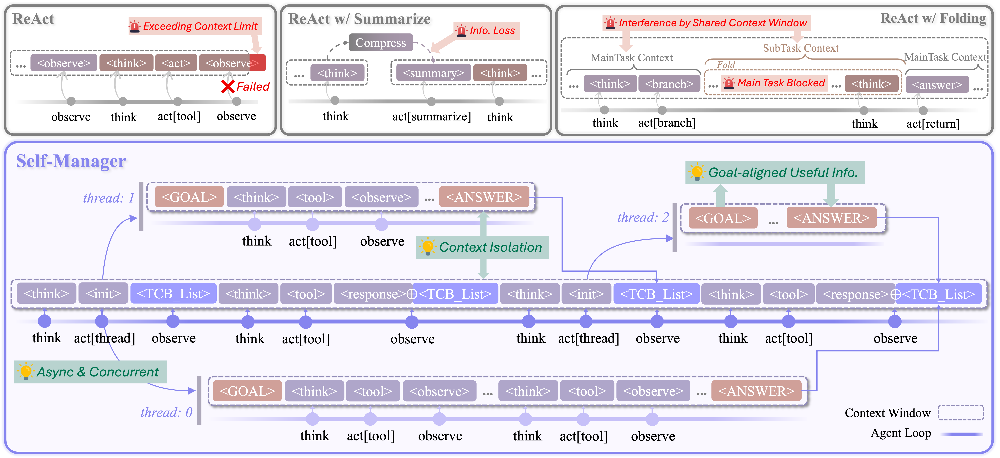

# ParallelAgent

This repository focuses on the monolithic agent archtecture with parallel execution. It distinguishes itself from multi-agent systems by having an autonomous and adaptive design, which allows for more efficient integration of parallel, tool-integrated reasoning to solve more challenging tasks.


<div align="center">
  <picture>
      
  </picture>
</div>


## Parallel Agent Loop: Self-Manager

**Self-Manager** is a parallel single-agent loop architecture. It introduce the concept of *threads*, where the main thread directly handles the user task and can spawn subthreads. This allows for the decomposition of complex tasks and the distribution of subtasks to subthreads. Notably, Self-Manager exhibits the following features:
- Asynchrony: Self-Manager executes in parallel, and the main thread is not blocked by the execution of subthreads.
- Concurrency: Self-Manager can initialize multiple subthreads simultaneously at any iteration turn, enabling parallel exploration of different perspectives of a task.
- Context Isolation:  In Self-Manager, each thread has its own context window, ensuring that subtasks do not interfere with one another. Upon completion, each subthread will return the result of its subtask to the context of the main thread.

To enable these capabilities in the parallel agent loop, Self-Manager introduce the *Thread Control Block* (TCB), a structured object encapsulating each subthread’s information. The main threads can monitor all subthreads by observing the TCB list, thereby enabling self-managed multi-threaded execution.


<div align="center">
  <picture>
      
  </picture>
</div>


### Inference

The inference of a monolithic parallel agent is built on concurrent requests to the same base model. We use [SGLang](https://github.com/sgl-project/sglang) to deploy the agent’s base model, enabling better support for simultaneous, high-throughput multi-threaded requests.

We recommend separating the model inference environment from the benchmark evaluation environment. When using the Qwen3 series models in our experiments, for instance, we use the following command to install the required dependencies for the model inference environment:
```bash
pip install 'sglang[all]>=0.5.2'
```
To support the high-level inference of Self-Manager, you need to install the environment with at least the following dependencies:
```bash
transformers==4.51.3
openai==1.76.0
tiktoken==0.9.0
qwen_agent==0.0.26
tqdm==4.67.1
```

In our experiments, we use [DeepResearch Bench](https://huggingface.co/spaces/muset-ai/DeepResearch-Bench-Leaderboard) as the benchmark. It is an evaluation dataset for long-form deep research tasks, containing 50 Chinese and English questions. The model is required to generate long-form reports to complete each task.

<!-- You can use the following command to run Self-Manager on DeepResearch Bench, after you 填补了`.env`和`eval.sh`和`inference/run_eval.py`中需要补充的字段 -->

Before running Self-Manager on DeepResearch Bench, make sure to fill in the necessary fields in `.env`, `eval.sh`, and `inference/run_eval.py`. Then you can use the following command to run it:
```bash
bash eval.sh
```

*In principle, Self-Manager can be adapted to a wide range of downstream tasks. We would greatly welcome and appreciate evaluations on any other tasks.*


## Update

We will continue to update this repository with new methods for Monolithic Parallel Agent. Stay tuned!


## Citation

If our ParallelAgent is useful to you, please consider citing the following paper:
```bibtex
@article{xu2026self,
  title={Self-Manager: Parallel Agent Loop for Long-form Deep Research},
  author={Xu, Yilong and Zheng, Zhi and Long, Xiang and Cai, Yujun and Wang, Yiwei},
  journal={arXiv preprint arXiv:2601.17879},
  year={2026}
}
```

